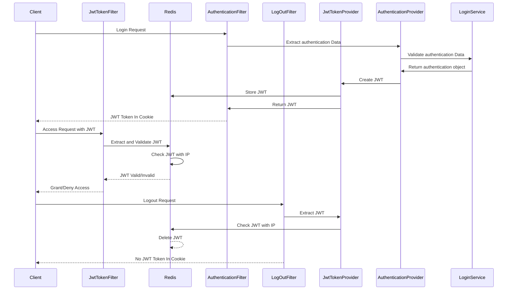

# jwt-redis-ip-protection-backend

> Spring Security + JWT + Redis에 IP 검증을 이용한 보안 필터 개발하기 <br>
> JWT 토큰만으로 보안을 지킬 수 있는가 의문을 시작으로 고도화 해보는 프로젝트 <br>
>
> > #### 목표
> >
> > Client가 JWT 토큰을 발급 시 XSS로 인한 토큰 탈취를 방지하기 위한 Cookie HTTPS 설정 추가 ( 브라우저에서 토큰 접근 불가 )
> > Client가 JWT 토큰을 탈취 당할 시, 토큰에 저장된 IP와 Request IP를 검증을 통해 CSRF를 방지 고도화

## ▶ 분석

<details><summary>Spring Security 프로세스 흐름도 ( 참고용 )</summary>

</details>

### 개발환경

<details>
<summary>build.gralde</summary>

```
plugins {
	id 'java'
	id 'org.springframework.boot' version '3.2.3'
	id 'io.spring.dependency-management' version '1.1.4'
}

group = 'com.tennod'
version = '0.0.1-SNAPSHOT'

java {
	sourceCompatibility = '17'
}

repositories {
	mavenCentral()
}

dependencies {
	// SpringBoot
	implementation 'org.springframework.boot:spring-boot-starter'
	implementation 'org.springframework.boot:spring-boot-starter-web'
	implementation 'org.springframework.boot:spring-boot-starter-aop'
	 implementation 'org.springframework.boot:spring-boot-starter-security'
	implementation 'org.springframework.boot:spring-boot-starter-logging'  // Spring Boot 로깅 스타터 (SLF4J와 Logback 포함)

	developmentOnly 'org.springframework.boot:spring-boot-devtools'

	// Lombok
	compileOnly 'org.projectlombok:lombok'
	annotationProcessor 'org.projectlombok:lombok'

	// Jakarta
	compileOnly 'jakarta.platform:jakarta.jakartaee-api:10.0.0'

	// Jackson
	implementation 'com.fasterxml.jackson.core:jackson-databind:2.15.2'
	testImplementation 'org.springframework.boot:spring-boot-starter-test'

	// Util Library
	implementation 'org.apache.commons:commons-lang3:3.12.0'
	implementation 'commons-io:commons-io:2.15.1'
	implementation 'com.googlecode.json-simple:json-simple:1.1.1'

	// JWT
	implementation 'io.jsonwebtoken:jjwt-api:0.12.5'
	runtimeOnly 'io.jsonwebtoken:jjwt-impl:0.12.5'
	runtimeOnly 'io.jsonwebtoken:jjwt-jackson:0.12.5'

	//redis
	implementation 'org.springframework.boot:spring-boot-starter-data-redis'

	// JSON
	implementation 'org.json:json:20240303'

}

tasks.named('test') {
	useJUnitPlatform()
}

```

</details>

| 라이브러리                      | 설명                                             |
| ------------------------------- | ------------------------------------------------ |
| spring-boot-starter             | Spring boot 환경                                 |
| spring-boot-starter-security    | Spring Security                                  |
| io.jsonwebtoken:jjwt-api:0.12.5 | JWT 토큰 발급                                    |
| spring-boot-starter-data-redis  | Spring boot 어플리케이션과 Redis를 연결하기 위함 |

### 서버에 적용할 보안 기능

| 기능                          | 설명                                                 |
| ----------------------------- | ---------------------------------------------------- |
| CORS 설정                     | 허용 가능한 Client Origin의 URL 및 Http 통신 제어    |
| DDOS 방지                     | POST로 들어온 Request Http Contents length 제한 설정 |
| 요청 URL 검증 설정            | 검증 대상, 미대상 URL 설정                           |
| JWT Token 검증 필터           | 서버 진입 시 JWT Token 검증 제어                     |
| 사용자 인증(로그인) 처리 필터 | 특정 로그인 URL을 통한 사용자 인증 처리 및 토큰 발급 |
| 로그아웃 처리 필터            | 특정 로그아웃 URL을 통한 사용자 로그아웃 처리        |

## ▶ 설계

### 프로세스 설계

> 프로세스는 크게 로그인, 인증, 로그아웃 프로세스로 나누었다. <br>
> 로그인은 해당 사용자가 서버를 사용할 권한이 있는 검증 후 쿠키에 토큰 리턴<br>
> 인증은 Client가 JWT 토큰과 함께 API를 보냈을 때, 토큰 검증과 Redis에 저장된 Token에 IP를 통해 검증 <br>
> 로그아웃은 토큰 검증과 Redis에 저장된 Token을 삭제 후, 토큰이 없는 헤더를 반환한다.<br>



## ▶ 구현

### Authentication 구현

1. **AuthenticationFilter**

   - 특정 로그인 URL에 POST으로 들어온 request의 contentType과 Length를 검증
   - JWT 토큰 쿠키, 로그인 정보와 Client IP 추출
   - JWT 토큰 쿠키 유무에 따른 Authentication 객체 생성
     - 토큰 존재 시, 로그인 처리 후 재발급 처리 필요
     - 토큰 미존재 시, 일반 로그인 처리 후 신규 발급
   - AuthenticationProvider에 인증 객체 전달

2. **AuthenticationProvider**

   - AuthenticationManger의 구현체로 실제 인증 처리 담당
   - Authentication 객체와 DB 조회를 통해 인증 처리
   - 인증 성공 시 인증이 성공된 authentication 반환

3. **AuthenticationSuccessHandler**

   - 인증 성공 시 JWT 토큰 발급와 로그인 정보 반환
