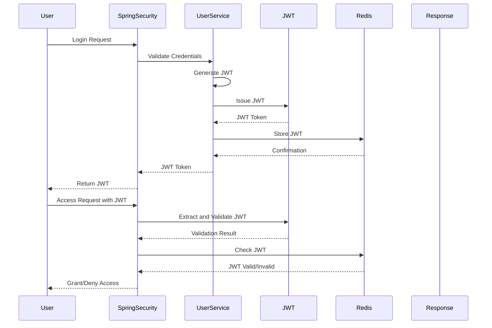

# jwt-redis-ip-protection-backend
> Spring Security + JWT + Redis에 IP 검증을 이용한 보안 필터 개발하기
>> 목적

## ▶ 분석
### Spring Security란?
> FilterChain 기반으로 이루어진 Spring 하위 프레임워크 
> Client Http 통신을 관리하며 주로 인증 및 인가를 담당  
> **Spring Security가 제공하는 인터페이스, 추상 클래스를 통해 보안 기능 커스텀마이징 가능**

### 프로세스 흐름도

##### [Spring Security Authentication Process]

### 서버에 적용할 보안 기능

|  기능   | 설명 |
| ------ | ------|
|     CSRF 설정   |      서버 진입 시 CSRF Token 검증 제어                 |
|     CORS 설정   |    허용 가능한 Client Origin의 URL 및 Http 통신 제어    |
|     DDOS 방지   |    POST로 들어온 Request Http Contents length 제한 설정    |
|     요청 URL 검증 설정   |    검증 대상, 미대상 URL 설정    |
|     JWT Token 검증 필터   |    서버 진입 시 JWT Token 검증 제어    |
|     사용자 인증(로그인) 처리 필터   | 특정 로그인 URL을 통한 사용자 인증 처리 및 토큰 발급       |
|     로그아웃 처리 필터   |    특정 로그아웃 URL을 통한 사용자 로그아웃 처리    |

## ▶ 설계

### 프로세스 설계
> 프로세스는 크게 로그인, 인증, 로그아웃 프로세스로 나누었다.
> 로그인은 해당 사용자가 서버를 사용할 권한이 있는 사용인지 확인
> Client가 JWT 토큰과 함께 API를 보냈을 때, 

