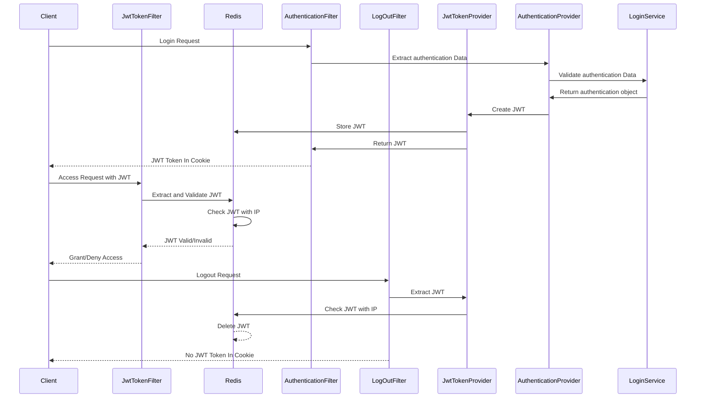

# jwt-redis-ip-protection-backend

 #### 배경
>  사내 CRM 프로젝트에서 기존 서버 사이드 JSP 프로젝트를 Cilent를 Vue로 전환하면서 Server가 stateless 형식을 가지고 의존성을 분리 시키는 작업이 필요했다.
>  일반적인 Spring Security, JWT, Redis 방식으로 보안성을 증가 시키고 분리시키는 기획을 가졌지만 항상 Token 탈취 우려가 있어 Client IP 까지 추가적으로 넣어 해당 컴퓨터로 로그인한 사용자만 우리 서버를 이용하는 방식으로 전략 짜보았다. 이를 전면 개발해보고 개선 사항을 기록한다.
>  Spring Security + JWT + Redis에 IP 검증을 이용한 보안 필터 개발하기.
>  JWT 토큰만으로 보안을 지킬 수 있는가 의문을 시작으로 고도화 작업.

 #### 목표
>  Client가 JWT 토큰을 발급 시 XSS로 인한 토큰 탈취를 방지하기 위한 Cookie HTTPS 설정 추가 ( 브라우저에서 토큰 접근 불가 )
>  Client가 JWT 토큰을 탈취 당할 시, 토큰에 저장된 IP와 Request IP를 검증을 통해 CSRF를 방지 고도화

## 목차

1. [분석](#-분석)
2. [설계](#-설계)
3. [구현](#-구현)
4. [테스트](#-테스트)
5. [Problem-Solving and Key Considerations](#-Problem-Solving-and-Key-Considerations)

---

## ▶ 분석

<details><summary>Spring Security 프로세스 흐름도 ( 참고용 )</summary>

</details>

<details><summary>Redis 정리</summary>
1. Key Value 쌍에 비정형 데이터 저장소 </br>
2. 인메모리 데이터 구조 </br>
	- 데이터를 디스크나 외부 저장장치에  저장하는게 아니 RAM에 저장 </br>
	- 데이터를 디스크에서 읽는 것보다 훨씬 빠르게 접근 가능 </br>
	- 고속 데이터 처리, 실시간 분석, 캐싱, 트랜잭션 처리 등에 이용 </br>
	- Spring Data Redis은 Lettuc와 Jedis라는 두 가지 오픈 소스 제공 </br>
3. 캐시 서버 구축 </br>
	- Look aside cache 방식 ( 찾고 없으면 db 조회 후 cache 저장) </br>
	- Write Back 방식 ( 모든 데이터를 cache에 저장 후 db에 저장 후 삭제) </br>
</details>

### 개발환경

<details>
<summary>build.gralde</summary>

```
plugins {
	id 'java'
	id 'org.springframework.boot' version '3.2.3'
	id 'io.spring.dependency-management' version '1.1.4'
}

group = 'com.tennod'
version = '0.0.1-SNAPSHOT'

java {
	sourceCompatibility = '17'
}

repositories {
	mavenCentral()
}

dependencies {
	// SpringBoot
	implementation 'org.springframework.boot:spring-boot-starter'
	implementation 'org.springframework.boot:spring-boot-starter-web'
	implementation 'org.springframework.boot:spring-boot-starter-aop'
	 implementation 'org.springframework.boot:spring-boot-starter-security'
	implementation 'org.springframework.boot:spring-boot-starter-logging'  // Spring Boot 로깅 스타터 (SLF4J와 Logback 포함)

	developmentOnly 'org.springframework.boot:spring-boot-devtools'

	// Lombok
	compileOnly 'org.projectlombok:lombok'
	annotationProcessor 'org.projectlombok:lombok'

	// Jakarta
	compileOnly 'jakarta.platform:jakarta.jakartaee-api:10.0.0'

	// Jackson
	implementation 'com.fasterxml.jackson.core:jackson-databind:2.15.2'
	testImplementation 'org.springframework.boot:spring-boot-starter-test'

	// Util Library
	implementation 'org.apache.commons:commons-lang3:3.12.0'
	implementation 'commons-io:commons-io:2.15.1'
	implementation 'com.googlecode.json-simple:json-simple:1.1.1'

	// JWT
	implementation 'io.jsonwebtoken:jjwt-api:0.12.5'
	runtimeOnly 'io.jsonwebtoken:jjwt-impl:0.12.5'
	runtimeOnly 'io.jsonwebtoken:jjwt-jackson:0.12.5'

	//redis
	implementation 'org.springframework.boot:spring-boot-starter-data-redis'

	// JSON
	implementation 'org.json:json:20240303'

}

tasks.named('test') {
	useJUnitPlatform()
}

```

</details>

| 라이브러리                      | 설명                                             |
| ------------------------------- | ------------------------------------------------ |
| spring-boot-starter             | Spring boot 환경                                 |
| spring-boot-starter-security    | Spring Security                                  |
| io.jsonwebtoken:jjwt-api:0.12.5 | JWT 토큰 발급                                    |
| spring-boot-starter-data-redis  | Spring boot 어플리케이션과 Redis를 연결하기 위함 |

### 서버에 적용할 보안 기능

| 기능                          | 설명                                                 |
| ----------------------------- | ---------------------------------------------------- |
| CORS 설정                     | 허용 가능한 Client Origin의 URL 및 Http 통신 제어    |
| DDOS 방지                     | POST로 들어온 Request Http Contents length 제한 설정 |
| 요청 URL 검증 설정            | 검증 대상, 미대상 URL 설정                           |
| JWT Token 검증 필터           | 서버 진입 시 JWT Token 검증 제어                     |
| 사용자 인증(로그인) 처리 필터 | 특정 로그인 URL을 통한 사용자 인증 처리 및 토큰 발급 |
| 로그아웃 처리 필터            | 특정 로그아웃 URL을 통한 사용자 로그아웃 처리        |

## ▶ 설계

### 프로세스 설계

> 프로세스는 크게 로그인, 인증, 로그아웃 프로세스로 나누었다. <br>
> 로그인은 해당 사용자가 서버를 사용할 권한이 있는 검증 후 쿠키에 토큰 리턴<br>
> 인증은 Client가 JWT 토큰과 함께 API를 보냈을 때, 토큰 검증과 Redis에 저장된 Token에 IP를 통해 검증 <br>
> 로그아웃은 토큰 검증과 Redis에 저장된 Token을 삭제 후, 토큰이 없는 헤더를 반환한다.<br>



### AccessToken과 RefreshToken 관리방안

> AccessToken은 시간을 간소화 하고 JwtFilter에서는 유효성 검사 및 추가로 request에 Client IP 와 AccessToken 내에 존재한 IP를 대조한다. (보안성 강화) </br>
> RefreshToken은 시간을 길게 잡아 AccessToken이 만료 될 시 재발급 시에 검증하는 토큰으로 활용한다. </br>

1. **Client (AccssToken, RefreshToken) | Redis (RefreshToken)**

   - Client에 Token을 쿠키로 담아 줄 시 HttpOnly 설정을 통해 XSS를 예방 가능
   - 서버에 접근 시 RefreshToken을 탈취 한다면 서버는 단순 Redis와 비교를 해서 Access를 발급하기 때문에 해커는 AccessToken을 발급 받을 수 있음

2. **Client (AccssToken) | Redis (AccssToken, RefreshToken)**

   - RefreshToken을 Redis에서 보관하고 있다고 했을 때, Client가 가지고 있을 때 보다 더 안전성이 우수하다고 생각
   - AccessToken이 만료되면 Redis에 저장된 AccessToken 키를 전제로 RefreshToken이 유효하다면 AccessToken을 재발급하고 Redis는 새로 갱신된 Access와 기존 Refresh로 업데이트
   - **채택**

## ▶ 구현

### Authentication 구현

1. **AuthenticationFilter**

   - 특정 로그인 URL에 POST으로 들어온 request의 contentType과 Length를 검증
   - JWT 토큰 쿠키, 로그인 정보와 Client IP 추출
   - JWT 토큰 쿠키 유무에 따른 Authentication 객체 생성
     - 토큰 존재 시, 로그인 처리 후 재발급 처리 필요
     - 토큰 미존재 시, 일반 로그인 처리 후 신규 발급
   - AuthenticationProvider에 인증 객체 전달

2. **AuthenticationProvider**

   - AuthenticationManger의 구현체로 실제 인증 처리 담당
   - Authentication 객체와 DB 조회를 통해 인증 처리
   - 인증 성공 시 인증이 성공된 authentication 반환

3. **AuthenticationSuccessHandler**

   - 인증 객체 일시 AccessToken과 RefreshToken 발급
   - 기존 토큰 존재 시, Redis에 저장 된 Refresh 토큰 제거
   - 발급 된 AccessToken과 RefreshToken은 Redis에 저장
   - 쿠키에 (AccessToken) 토큰 세팅 후 헤더에 추가
   - response 객체에 컨텐츠 타입과 body (로그인 결과 정보) 작성 후 리턴

### Jwt Verification 구현

1. **JwtTokenFilter**

   - Request 객체에서 accessTokenCookie 추출 쿠키 존재 확인
   - 토큰 존재 시, 토큰에 존재하는 IP와 Request IP 확인
   - 토큰 유효성 체크 이상 없으면 통과, 만료 시 Redis에서 RefreshToken 추출
   - RefreshToken 유효 시 AccessToken 재발급 후 Response Header 신규 쿠키 세팅 후 통과
   - RefreshToken 만료 시, 재 로그인 요청

   - **Spring SecurityContextHolder**
     - dofilter 넘어 가기 전 반드시 token에서 Authentication 객체를 SecurityContextHolder 등록 해줘야 한다.
     - 등록이 없다면 그 뒤에 AnonymousAuthenticationFilter, ExceptionTranslationFilter, AuthorizationFilter에서 요청이 거부되고 403 혹은 401 에러를 반환한다.
     - SecurityContextHolder은 Spring Security 전역 객체라 생각해야한다. 다음 필터들이 인증된 객체를 가지고 security 프로세스를 흘러가기에 요청 쓰레드 마다 인증이 되었다면 인증 객체를 꼭 등록이 필요하다

### LogOut 구현

1. **LogOutFilter**
   - logoutUrl과 일치 시, Cookie에 AccessToken 유무 확인
   - AccessToken 미존재 시, 400 에러 반환
   - AccessToken 존재 시, Redis에 AccessToken와 RefreshToken 삭제
   - 헤더에 쿠키 연장 시간을 0초로 세팅 후 반환

## ▶ 테스트

### Authentication 프로세스 통한 토큰 발급과 Redis에 저장


#### Redis


---

### Jwt Verification프로세스 토큰으로 /ping API 접근


---

### LogOut 프로세스 통한 토큰 초기화


## ▶ Problem-Solving and Key Considerations

1.**SecurityContextHolder 다루기**

- Spring Security 공식 문서에도 나와 있지만 SecurityContextHolder는 기본적으로 스레드 로컬 변수를 사용하여 보안 컨텍스트를 관리하는데, **SecurityContextHolder.getContext() 메서드를 사용하여 보안 컨텍스트를 설정할 때, 동일한 보안 컨텍스트를 여러 스레드에서 동시에 접근하고 수정할 가능성이 있기에 꼭 한 쓰레드 마다 별도에 SecurityContext 생성하고 등록 해주자**

```Java
// 인증 객체 발급
AuthenticationToken authenticationToken = jwtTokenProvider.getAuthenticationToken(accessToken);

SecurityContext context = SecurityContextHolder.createEmptyContext();
context.setAuthentication(authenticationToken);

// SecurityContextHolder 인증 객체 저장
SecurityContextHolder.setContext(context);
```

2.**만료된 JWT 토큰에서 Client IP 가져오기**

- 기획 했던 것 중 제일 핵심은 AccessToken에서 Client IP와 Request객체 요청 IP를 비교하여 Servlet으로 넘기는 과정이다. 이에 JwtTokenFilter에서 JWT 토큰을 파싱 후 payload에서 로그인 한 Client IP를 가져오는 방식이 필연적이였다. **만약 만료가 된 JWT토큰을 파싱하게 된다면 ExpiredJwtException 예외 처리를 하게 된다** 이에 예외 처리에 따라 Handling을 하는게 정말 중요했다. 만료 된 토큰 일지라도 요청을 보낸 컴퓨터가 인증을 했던 사용자 인지 확인을 꼭 해야했다.

```Java
private Claims getPayloadFromJwtToken(String token) {
   Claims claims = null;
   try {
       claims = Jwts.parser().verifyWith(key).build().parseSignedClaims(token).getPayload();
   } catch (ExpiredJwtException e) {
      log.debug("ExpiredJwtException Token");
      claims = e.getClaims();
   } catch (Exception e) {
      throw e;
   }
     return claims;
   }
```

3.**AOP 적용하여 메타데이터 생성하기**
- **참고**
  https://github.com/silberbullet/jwt-redis-ip-protection-backend/blob/e90c36ff23f680ae92d0b77f498d2c4e03d8b1e9/src/main/java/com/develop/backend/aspect/UserAspect.java#L30

- 로그인 한 사용자는 Insert, update 등의 CRUD 작업을 행 할시, DB에 등록 / 수정 사용자, IP, 날짜를 공통적으로 세팅하기 위해 AOP 를 추가 하였다. AOP를 통해 로그, 트랙잰션 관리, 보안 관련 해서 다양한 공통 모듈 처리를 할 수 있지만 여기서는 보안 역할로 AOP를 만들었다.

- 각 Controller 안에서 method 수행 시, 요청 VO가 CMMaster 를 상속 받고 있다면 userId, userIp가 세팅이 되도록 하였다.

