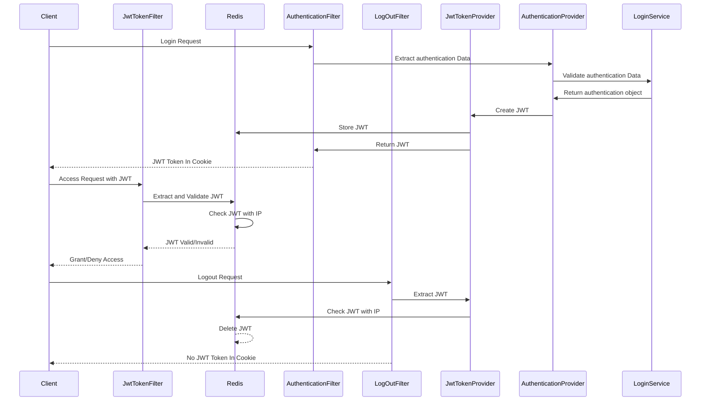

# jwt-redis-ip-protection-backend
> Spring Security + JWT + Redis에 IP 검증을 이용한 보안 필터 개발하기  
> JWT 토큰만으로 보안을 지킬 수 있는가 의문을 시작으로 고도화 해보는 프로젝트  
>> #### 목표
>> Client가 JWT 토큰을 발급 시 XSS로 인한 토큰 탈취를 방지하기 위한 Cookie HTTPS 설정 추가 ( 브라우저에서 토큰 접근 불가 )
>> Client가 JWT 토큰을 탈취 당할 시, 토큰에 저장된 IP와 Request IP를 검증을 통해 CSRF를 방지 고도화 

## ▶ 분석

Spring Security 프로세스 흐름도 ( 참고용 )

### 개발환경 
> FilterChain 기반으로 이루어진 Spring 하위 프레임워크 
> Client Http 통신을 관리하며 주로 인증 및 인가를 담당  
> **Spring Security가 제공하는 인터페이스, 추상 클래스를 통해 보안 기능 커스텀마이징 가능**

### 서버에 적용할 보안 기능

|  기능   | 설명 |
| ------ | ------|
|     CORS 설정   |    허용 가능한 Client Origin의 URL 및 Http 통신 제어    |
|     DDOS 방지   |    POST로 들어온 Request Http Contents length 제한 설정    |
|     요청 URL 검증 설정   |    검증 대상, 미대상 URL 설정    |
|     JWT Token 검증 필터   |    서버 진입 시 JWT Token 검증 제어    |
|     사용자 인증(로그인) 처리 필터   | 특정 로그인 URL을 통한 사용자 인증 처리 및 토큰 발급       |
|     로그아웃 처리 필터   |    특정 로그아웃 URL을 통한 사용자 로그아웃 처리    |

## ▶ 설계

### 프로세스 설계
> 프로세스는 크게 로그인, 인증, 로그아웃 프로세스로 나누었다.  
> 로그인은 해당 사용자가 서버를 사용할 권한이 있는 검증 후 쿠키에 토큰 리턴 
> 인증은 Client가 JWT 토큰과 함께 API를 보냈을 때, 토큰 검증과 Redis에 저장된 Token에 IP를 통해 검증  
> 로그아웃은 토큰 검증과 Redis에 저장된 Token을 삭제 후, 토큰이 없는 헤더를 반환한다. 

